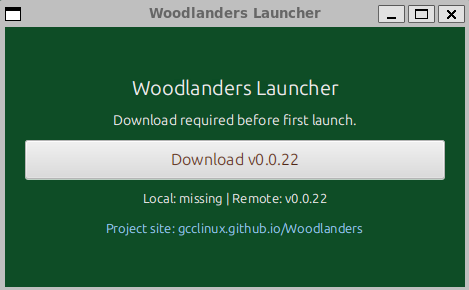

# Woodlanders-Launcher

<div align="center" style="margin: 16px 0;">
  
  
  <br/>
  
  <a href="https://github.com/gcclinux/Woodlanders/issues">
    
  </a>
  <a href="https://github.com/gcclinux/Woodlanders/discussions">
    
  </a>
    <a href="https://snapcraft.io/woodlanders-launcher">
    
  </a>
  <a href="https://www.buymeacoffee.com/gcclinux">
    
  </a>
  <a href="https://github.com/sponsors/gcclinux">
    
  </a>
  
  <br/>
</div>

> 💬 Status: **Earliest Alpha Phase**  
> 🔁 Updates: **Daily / Evening incremental builds**  
> 📥 Installer: **Single download – auto-update enabled**  
> 🗺️ Story Mode: **Not yet implemented**  
> 🧪 Your Role: Explorer, tester, trail maker

Woodlanders Launcher is a JavaFX desktop app for the
[Woodlanders](https://gcclinux.github.io/woodlanders/) game. It automatically
checks for updates, downloads the latest client from GitHub releases, caches it
locally, and launches the game with a single click.

## Features

- ✅ **Automatic Updates** — checks GitHub for the latest game version
- ✅ **Smart Caching** — downloads and caches game files locally
- ✅ **Version Detection** — compares local and remote versions with SHA-256
- ✅ **One-Click Launch** — simple, intuitive interface to play
- ✅ **Cross-Platform** — Windows, macOS (Apple Silicon), and Linux (Snap/Flatpak/TAR.GZ)

See [`docs/QUICK_START.md`](docs/QUICK_START.md) for more.

---

## About the Game (Early Alpha)

You wake beneath a quiet pixel sky—no prophecy to follow, no quest log to obey—just wind over grass, rain that sometimes drifts in, birds crossing the horizon, and a compass that remembers where you began. This is Woodlanders in its earliest form: an open, living sandbox still knitting itself together night by night.

### What Doesn’t Exist Yet

- No scripted lore
- No story campaign
- No endgame arc

Instead: a procedural world, emerging systems, trees that fall and return, hunger that presses forward, bamboo that begins as a promise and grows if you give it time.

> Every mechanic you touch is a foundation stone. Every small imperfection is an invitation.

### How Builds Work

- 🧩 Minimal installer: one download
- 🔍 Auto-checks for new versions
- 🌒 Evening + daily pushes: sometimes subtle tuning, sometimes new possibilities
- 🧭 You’re ahead of the map — your feedback carves the path

### What to Expect

| Don’t Expect     | Do Expect  |
|------------------|------------|
| Polish           | Potential  |
| Finished loops   | Change     |
| Full narrative   | Emergence  |
| Packed world     | Quiet moments |

Moments where the world feels sparse—and others where sudden rain or a line of birds makes it feel briefly alive. That contrast is the frontier.

### Your Impact

If you explore, plant, test, nudge the edges, and tell us what you felt—you help shape what comes next:

- 🔨 Crafting
- 🏗️ Building
- 🌅 Day/Night cycle
- 🐾 Creatures
- 🔊 Sound & ambience
- 📖 Future story arcs

**Woodlanders isn’t finished — it’s becoming.**

> Join early. Wander freely. Grow it with us.

**Tagline**: Woodlanders — not a story yet, just the dawn before one.

> 🐦 Optional share: “I’m playing Woodlanders in its alpha dawn—no story yet, just systems waking up. Exploring while it learns to become a world.”

---

## Quick Start

[](https://snapcraft.io/woodlanders-launcher)

### Windows

1. **Download** the latest launcher from [Releases](https://github.com/gcclinux/woodlanders-launcher/releases/latest)
2. **Extract** the ZIP file
3. **Run** `woodlanders-setup-launcher.exe` or right-click `install.ps1` → Run with PowerShell
4. **Launch** from desktop shortcut or Start Menu

The installer automatically downloads Java if needed.

### macOS (Apple Silicon)

1. **Download** the latest DMG from [Releases](https://github.com/gcclinux/woodlanders-launcher/releases/latest)
2. **Open** the DMG file
3. **Drag** Woodlanders Launcher to your Applications folder
4. **First Launch**: Control+click (or right-click) the app → **Open** to bypass Gatekeeper
5. **Subsequent Launches**: Double-click normally

**System Requirements**: macOS 11 (Big Sur) or later, Apple Silicon (M1/M2/M3/M4)

No additional Java installation required — JRE is bundled!

### Ubuntu / Debian (Snap)

```bash
sudo snap install woodlanders-launcher
```

Available in the [Snap Store](https://snapcraft.io/woodlanders-launcher).

### Linux (Flatpak)

1. **Download** the latest Flatpak from [Releases](https://github.com/gcclinux/woodlanders-launcher/releases/latest)
2. **Install**:
   ```bash
   flatpak install --user woodlanders-launcher.flatpak
   ```
3. **Run**:
   ```bash
   flatpak run io.github.gcclinux.woodlanders.launcher
   ```

No additional Java installation required — JRE is bundled!

### Windows Uninstall

- Preferred: Double‑click `woodlanders-uninstall.exe` (included in the installer ZIP)
- Alternative: Right‑click `uninstall.ps1` → Run with PowerShell
- Manual cleanup (fallback):
  ```powershell
  Remove-Item "$env:LOCALAPPDATA\Woodlanders" -Recurse -Force -ErrorAction SilentlyContinue
  Remove-Item "$env:USERPROFILE\Desktop\Woodlanders Launcher.lnk" -Force -ErrorAction SilentlyContinue
  Remove-Item "$env:APPDATA\Microsoft\Windows\Start Menu\Programs\Woodlanders" -Recurse -Force -ErrorAction SilentlyContinue
  Remove-Item "$env:USERPROFILE\.cache\woodlanders-javafx" -Recurse -Force -ErrorAction SilentlyContinue
  Write-Host "Clean uninstall complete" -ForegroundColor Green
  ```

The installer will automatically download Java if you don't have it installed.

### Windows (Manual — Java Required)

1. **Download**: Manual ZIP from the latest release
2. **Require**: Java 21+ from [adoptium.net](https://adoptium.net/)
3. **Extract** and double-click `launcher.bat`

### Linux (TAR.GZ — Manual)

```bash
# Install Java if not already installed
sudo apt install openjdk-21-jre  # Debian/Ubuntu
# or
sudo dnf install java-21-openjdk  # Fedora

# Extract and run
tar -xzf woodlanders-launcher-linux-0.1.2.tar.gz
cd woodlanders-launcher-linux-0.1.2
chmod +x launcher.sh
./launcher.sh
```

---

## System Requirements

### Windows
- OS: Windows 10 or later
- Java: Not required (installer auto-downloads Java 21)
- Disk Space: ~200 MB (including Java runtime)

### macOS
- OS: macOS 11 (Big Sur) or later
- Architecture: Apple Silicon (M1, M2, M3, M4)
- Java: Not required (bundled in app)
- Disk Space: ~250 MB (including Java runtime)

### Linux
- OS: Any modern Linux distribution
- Java: JRE 21+ (not needed for Snap package)
- Disk Space: ~200 MB

---

## How It Works

1. **Launch** the launcher application
2. Launcher checks GitHub for the latest Woodlanders client release
3. If a new version is available, it's automatically downloaded
4. Click **"Launch Game"** to start playing
5. Game files are cached locally for faster subsequent launches

---

## Building from Source

See [`docs/BUILD_GUIDE.md`](docs/BUILD_GUIDE.md) for detailed build instructions.

```bash
# Build all distribution packages
gradle :app:buildAllPackages

# Run locally for testing
gradle run
```

---

## Configuration

Game files and cache are stored in:
- **Windows**: `%USERPROFILE%\.config\woodlanders\`
- **macOS**: `~/Library/Application Support/Woodlanders/`
- **Linux**: `~/.config/woodlanders/`
- **JavaFX Cache** (Windows/Linux): `~/.cache/woodlanders-javafx/`
- **JavaFX Cache** (macOS): `~/Library/Caches/woodlanders-javafx/`

---

## Troubleshooting

### Windows: "Java is not recognized"
- The installer package automatically handles Java installation
- For manual installation, download Java from [adoptium.net](https://adoptium.net/)

### macOS: "App can't be opened because it is from an unidentified developer"
- Control+click (or right-click) the app and select **Open**
- Click **Open** in the security dialog
- This only needs to be done once on first launch

### macOS: App won't start
- Verify you're running macOS 11 (Big Sur) or later
- Ensure you have an Apple Silicon Mac (M1/M2/M3/M4)
- Check Activity Monitor to see if the process is running
- Try removing the app and reinstalling from the DMG

### Linux: Application won't start
- Ensure Java 21+ is installed: `java -version`
- For Snap: Check permissions with `snap connections woodlanders-launcher`

### Game won't download
- Check your internet connection
- Verify GitHub is accessible
- Check logs in the application console

---

## Contributing

Contributions are welcome! Please read the build guide and submit pull requests.

## License

See [LICENSE](LICENSE) file for details.

## Links

- **Game Website**: [https://gcclinux.github.io/woodlanders/](https://gcclinux.github.io/woodlanders/)
- **Game Repository**: [Woodlanders on GitHub](https://github.com/gcclinux/woodlanders)
- **Installation Guides**:
  - [Windows Installation Guide](docs/WINDOWS_INSTALL_GUIDE.md)
  - [Build Guide](docs/BUILD_GUIDE.md)